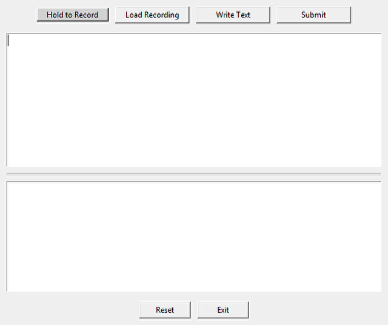

# Offline Voice-to-Text + Grammar Checker 🎙️✍️

> A fully offline desktop application that converts voice to text and checks grammar — all without needing internet access.

---

##  App Demo

  

---

## Features

 Record voice using a **walkie-talkie style button**  
 Load audio files (.wav, .mp3, .ogg, .flac, .m4a, .aac)  
 Manually write or paste text  
 Check grammar and get corrected output  
 Runs entirely **offline** – no internet required  
 Built using open-source tools  

---

##  Why This Project?

First of all, and as it says in the description, it's a Hands-on implementation of a Speech-to-Text Model "Vosk" with integrated grammar checking for enhanced usability
Living in areas with unstable internet (like Syria), I wanted to learn, experience and build something useful that doesn't rely on online services.  
This app helps me deal with audio model, and convert speech to text and correct grammar locally — and eventually, I hope to build my own models and share them freely via Telegram bots.

---

## 🛠️ Technologies Used

- **Tkinter** – GUI interface
- **Vosk** – Offline speech recognition
- **pyaudio** – Audio input capture
- **ffmpeg** – Audio format conversion
- **language_tool_python** – Grammar checking

---

## 📦 Requirements

Install dependencies using:

vosk pyaudio language-tool-python
Also ensure you have ffmpeg installed on your system.
